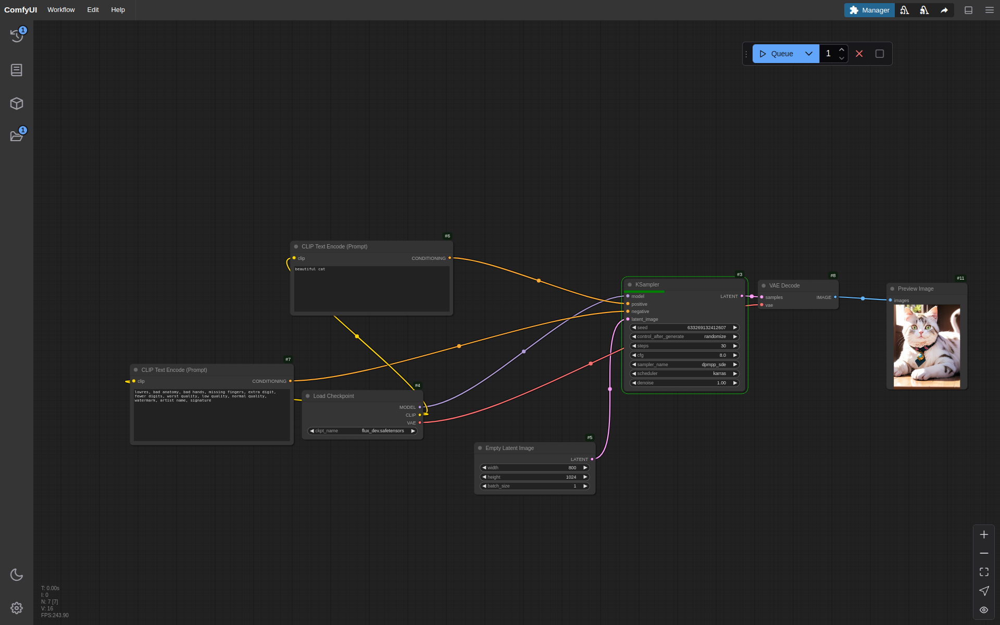

# ComfyUI Kubernetes Deployment

A production-ready Kubernetes deployment configuration for ComfyUI, an advanced node-based UI for Stable Diffusion.

## Overview

This repository contains Kubernetes manifests and configuration files to deploy ComfyUI in a scalable and maintainable way on Kubernetes clusters.

## Features

- 🚀 Production-ready Kubernetes deployment
- 💾 Persistent storage configuration
- 🔒 Security best practices
- 🔧 Resource management
- 📊 Monitoring setup

## Prerequisites

- Kubernetes cluster (1.18+)
- kubectl configured to communicate with your cluster
- Helm 3.0+
- Storage class available in your cluster
- NVIDIA GPU support (optional but recommended)

## Quick Start

git clone https://github.com/clement2323/comfyui.git  
cd cmfyui  
kubectl apply -f .

